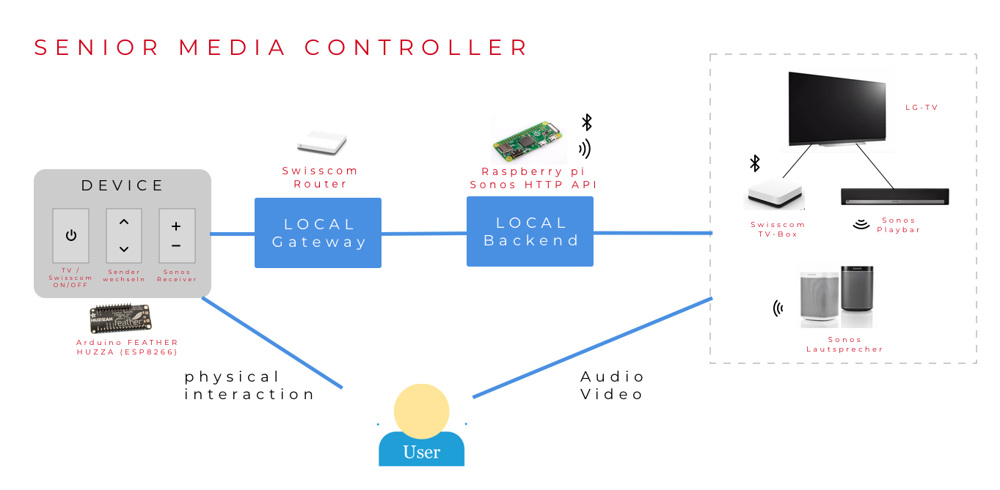

# Projektbeschreibung

## Ausgangslage
Für einen Mitbewohner im Seniorenalter soll eine vereinfachte Bedienung seiner TV und Audioanlage konstruiert werden. Der Mitbewohner hat ein [Swisscom-TV Abo](https://www.swisscom.ch/de/privatkunden/abos-tarife/inone-home/digital-tv.html) und verfügt über eine [Sonos-Audioanlage](https://www.sonos.com/en-us/home). 
Die jetzige Bedienung ist nicht optimal, da er für die einzelnen Komponenten jeweils eine separate Fernbedienung in die Hand nehmen muss.
-	TV (LG Fernseher) mit Fernbedienung einschalten
-	Swisscom TV mit Fernbedienung aktivieren und Programm wählen
-	Mit Sonos App (Mobilephone) die Lautstärke anpassen

## Lösungsidee 

Wie auf dem Reference model ersichtlich ist das Ziel, die erwähnten Anlagen über eine einzige Device zu steuern. 

Abb.1 Reference model

## Komponenten
### Sonos Anlage:

Die Einrichtung der Sonosgeräte erfolgt nur über deren App. Alle Geräte müssen im selben Netz integriert sein. Die Anlage wurde im Jahr 2017 installiert. Notwendigerweise braucht es die [Sonos Playbar](https://www.sonos.com/de-de/shop/playbar.html), die über den optischen Ausgang des Fernsehers das Audiosignal empfängt und diese dann drahtlos an die anderen Sonos Geäte überträgt.  
Die Sonos Geräte besitzen zwar Funktionstasten, aber die Bedienung ist so konzipiert, dass die Einstellungen über die App erfolgen sollten. Da die Geräte bereits installiert sind, brauchen wir eine API, die die Kommunikation mit der Anlage ermöglicht.

### Sonos API:

Auf der Suche sind wir auf folgende Sonos HTTP Api gestossen.  
>https://jishi.github.io/node-sonos-http-api/

Diese node.js basierte Api wird auf unseren raspberry pi implementiert. Für unseren Zweck ist diese Variante optimal. Die HTTP API läuft dann auf dem localhost(Port: 5005).  
>Beispielbefehle: 
>Befehl für Lautstärkeanhebung um 1% :
> http://localhost:5005/Fernsehzimmer/volume/+1  
> Befehl für Lautstärkeanhebung um -1%:
> http://localhost:5005/Fernsehzimmer/volume/-1 

Die Befehle für die Lautstärkeanpassung können über ein Arduino Modul wie Feather Huzza ESP8266 Wifi absetzen. Dieses Modul wird dann mit einer Batterie betrieben.

### Swisscom TV Box & LG Fernseher:

Die Fernbedienung des Swisscom TV-Box und des LG-Fernsehers verwendet Bluetooth Technologie. Wir konnten keine Dokus zur API der  beiden Geräte finden. Unsere Lösung orientiert sich  ........

