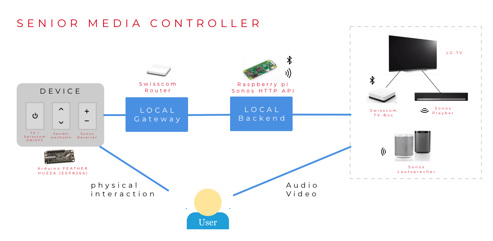

# Projektdokumentation

## Ausgangslage
Für einen Mitbewohner im Seniorenalter soll eine vereinfachte Bedienung seiner TV und Audioanlage konstruiert werden. Der Mitbewohner hat ein [Swisscom-TV Abo](https://www.swisscom.ch/de/privatkunden/abos-tarife/inone-home/digital-tv.html) und verfügt über eine [Sonos-Audioanlage](https://www.sonos.com/en-us/home). 
Die jetzige Bedienung der Anlagen findet er nicht optimal, da er für die einzelnen Komponenten jeweils eine separate Fernbedienung in die Hand nehmen muss.
-	TV (LG Fernseher) mit Fernbedienung einschalten
-	Swisscom TV mit Fernbedienung aktivieren und Programm wählen
-	Mit Sonos App (Mobilephone) die Lautstärke anpassen

## Lösungsidee 

Wie auf dem Reference model ersichtlich ist das Ziel, die erwähnten Anlagen über eine einzige Device zu steuern. 

Abb.1 Reference model

### Sonos Anlage:

Die Einrichtung der Sonosgeräte erfolgt nur über deren App. Alle Geräte müssen im selben Netz integriert sein. Die Anlage wurde im Jahr 2017 installiert. Notwendigerweise braucht es die [Sonos Playbar](https://www.sonos.com/de-de/shop/playbar.html), die über den optischen Ausgang des Fernsehers das Audiosignal empfängt und diese dann drahtlos an die anderen Sonos Geäte überträgt.  
Die Sonos Geräte besitzen zwar Funktionstasten, aber die Bedienung ist so konzipiert, dass die Einstellungen über die App erfolgen sollten. Da die Geräte bereits installiert sind, brauchen wir eine API, die die Kommunikation mit der Anlage ermöglicht.

## Ansteuerung Sonos Anlage:

Auf der Suche sind wir auf dem Netz auf folgende Sonos HTTP Api gestossen, welche eine REST API zur Verfügung stellt.   
>https://github.com/jishi/node-sonos-http-api

Diese Node.JS basierte [REST API](/03-Raspberrypi/sonosapi) ist auf unseren raspberry pi implementiert und läuft auf dem Localhost(Port: 5005). Zusätzlich ist ein [Service](/03-Raspberrypi/sonosapi-autostart.service) implementiert, welcher nach dem Hochfahren und bei einer erfolgreichen Wlan-Verbindung automatisch die API startet. Die [Befehle](/02-Arduino/ESP8266_remote_Client/config.h) der Lautstärkeregulierung werden über das [Arduino-Programm](/02-Arduino/ESP8266_remote_Client/ESP8266_remote_Client.ino), welches im Feather-Huzza-ESP8266 Modul implementiert ist, via Wifi an die Sonos API gesendet. Das Feather-Huzza-ESP8266 Modul wird mit drei Batterien vom Typ AAA betrieben.  
 
Sonos REST API auf dem Localhost
>Beispiele HTTP Requests: 
>Befehl für Lautstärkeanhebung um 1% :
> http://localhost:5005/Fernsehzimmer/volume/+1  
> Befehl für Lautstärkeanhebung um -1%:
> http://localhost:5005/Fernsehzimmer/volume/-1 

## Ansteuerung der Swisscom TV-Box:

Die Fernbedienung der Swisscom TV-Box wird über Bluetooth-Signale angesteuert. Die Bluetoothschnitstelle der Swisscom TV-Box ist nicht öffentlich zugänglich und erlaubt keine Kopplung. Daher mussten wir alternative Lösungen suchen. Auf der Swisscom-Homepage stellen wir fest, dass ein [IR-Dongle](https://www.swisscom.ch/de/privatkunden/produkte/smartphones/details.html/uhd-accessories-kit-10240233?payOption=ONE_TIME&useCase=HARDWAREONLY#tab%5Bselected%5D=0) für Universal Fernbedienungen angeboten wird. Dieses konnten wir bei [digitec.ch](https://www.digitec.ch/de/s1/product/swisscom-uhd-zubehoer-kit-fernbedienungserweiterung-5837599) bestellen. 

Die Swisscom stellt keine offizielle Dokumentaion über IR-Codes zur Verfügung, jedoch die nötigen IR-Codes konnten wir auf der Swisscom-Community Seite finden. 

>https://community.swisscom.ch/t5/Nutzung/Swisscom-TV-2-0-Fernbedienung-IR-Codes/td-p/506017

Die für unser Projekt relevanten Befehle sind im [Arduino-Konfigurationsfile](/02-Arduino/ESP8266_remote_Client/config.h) hinterlegt.

## Ansteuerung Fernseher:

Für das Ein-und Ausschalten des Fernsehers nutzen wir die Features der [HDMI-CEC](https://www.lifewire.com/hdmi-cec-4158343) Technolgie. Die Swisscom TV-Box und LG-Fernseher besitzen diese HDMI-CEC Funktion. Wie in den Abbildungen unten angezeigt, werden in beiden Geräten die HDMI-CEC aktiviert.

Nach dieser Anpassung wird der Fernseher automatisch nach Betriebszutand des Swisscom Tvs ein-oder ausgeschaltet. Eine genaue Anleitung für das Einrichten der Swisscom TV-Box findet man hier:
>https://community.swisscom.ch/t5/TV-Wissensbox/HDMI-CEC-Immer-auf-dem-richtigen-Kanal/ta-p/582271

## Von der Skizze zur Hardware:
Die Realisierung der Fernbedienung begann zuerst mit einer Skizze, dann mit der Umsetzung, die wie folgt ablief:
1. Auswahl der erfordlichen Schaltelemente
2. Mass des Gehäuses festlegen
3. Material bestellen
4. Zusammenbau (bohren, befestigen, beschriften)

Das Innenleben der Fernbedienung:

Das Ziel wurde erreicht und wir sind stolz, dass die Anlage mit einer einzigen Fernbedienung die gestellten Aufgaben steuern kann und damit auch den Senioren glücklich macht. 

#### Die zusammengebaute Fernbedienung besteht aus folgenden Elementen. Hier die Auflistung und die Bestelllinks.

>Desktopgehäuse Schwarz 129x64x42mm: 
https://www.distrelec.ch/de/desktopgehaeuse-schwarz-129x64x42mm-rnd-components-rnd-455-00102/p/30064323

>Feather HUZZAH ESP8266 WiFi, Adafruit: 
https://www.distrelec.ch/de/feather-huzzah-esp8266-wifi-adafruit-3213/p/30129211?track=true&no-cache=true

>Grove Shield FeatherWing Adapter: 
https://www.distrelec.ch/de/grove-shield-featherwing-adapter-fuer-particle-mesh-adafruit-4309/p/30158133?q=+Grove+Shield+&pos=3&origPos=3&origPageSize=10&track=true

>Grove Infrarot-Strahler: 
https://www.distrelec.ch/de/grove-infrarot-strahler-seeed-studio-101020026/p/30069809?queryFromSuggest=true

>Grove blaue LED-Taste, Seeed Studio: 
https://www.distrelec.ch/de/grove-blaue-led-taste-seeed-studio-111020046/p/30121601

>Drehwinkelsensor, Seeed Studio: 
https://www.distrelec.ch/de/drehwinkelsensor-seeed-studio-101020017/p/30069803

>Aluminiumknopf Silber ø29mm Schwarze Linie: 
https://www.distrelec.ch/de/aluminiumknopf-silber-o29mm-schwarze-linie-rnd-components-rnd-210-00347/p/30092647

>Grove - Taste (P), Seeed Studio: 
https://www.distrelec.ch/de/grove-taste-seeed-studio-111020000/p/30069945

>3 x AAA Battery Holder with On/Off Switch and 2-Pin JST: 
https://www.adafruit.com/product/727

#### Hier die Bestellinks für externen Elemente, die wir für dieses Projekt eingesetzt haben:

>Swisscom UHD Zubehör-Kit, Infrarotempfänger: 
https://www.digitec.ch/de/s1/product/swisscom-uhd-zubehoer-kit-fernbedienungserweiterung-5837599

>Raspberry Pi Zero W Full Starterkit (BCM2835): 
https://www.digitec.ch/de/s1/product/raspberry-pi-zero-w-full-starterkit-bcm2835-entwicklungsboard-kit-7056749